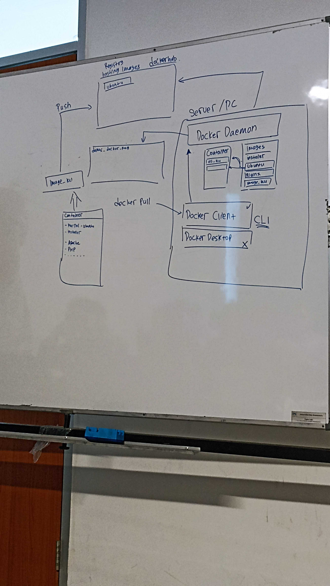
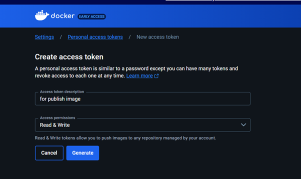

### Init

```
docker ubuntu
```

### mencari docker ubuntu yang ada di registry

```
docker search ubuntu
```

### menarik/download docker dari library docker hub image

```
docker pull ubuntu
```

### Component docker

1. Docker Demon (Server Docker): mesin utama untuk kontainerisasi docker seperti pengatran port
2. Client Docker : untuk dapat berinteraksi dengan server maka dibutuhkan client yang berbentuk CLI seperti docker pull. Pada versi GUI disebut docker desktop
3. Docker Image: merupakan tempat untuk instalasi seperti ubuntu, nginx, dll
4. Docker Container : setelah instalasi lib dengan image maka akan di kontainerisasi namun dengan nama yang berbeda seperti OS_ku
5. Docker Registry : dalam registery terdapat hosting image, yang secara default disediakan di dockerhub. docker registry dapat dibuat sendiri untuk credential sendiri



## Docker Image

### Checking image

```
docker images
```

### Menjalankan docker secara interaktif

```
docker run -t {image_name}
```

## Docker container

### Mengetahui docker container apa aja yang ada

```
docker ps -a
```

### Menjalankan Contianer

```
docker start {container_id}
```

### Mounting file

```
mkdir new
touch teh.txt

docker run -it -v //c/ADIT/udinus/2023/sisi-server/learn-docker/new:/home/ubuntu/new ubuntu
```

## Setup container with install nginx server

### Buat container baru dan di mounting volume ke ubuntu

```
docker run -it -p 8081:80 -v /{path local folder}:/var/www/html --name {name_container} ubuntu bas
h
```

### Lakukan apt update di ubuntu dan install nginx

```
apt update
apt install -y nginx
```

### Start web server nginx untuk testing

```
service nginx start
```

## Push Image ke docker hub

### Lakukan login ke docker hub dan masukkan password

```
docker login -u {username}
```

### Password pada docker hub juga bisa menggunakan Personal access token yang di set



### Commit image

```
docker commit {container_name} username/image_name
```

### Push commit image

```
docker push username/image_name
```
